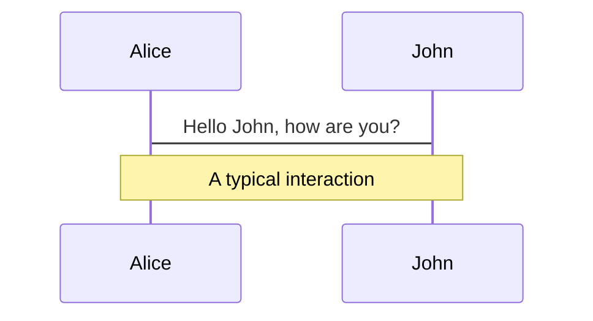
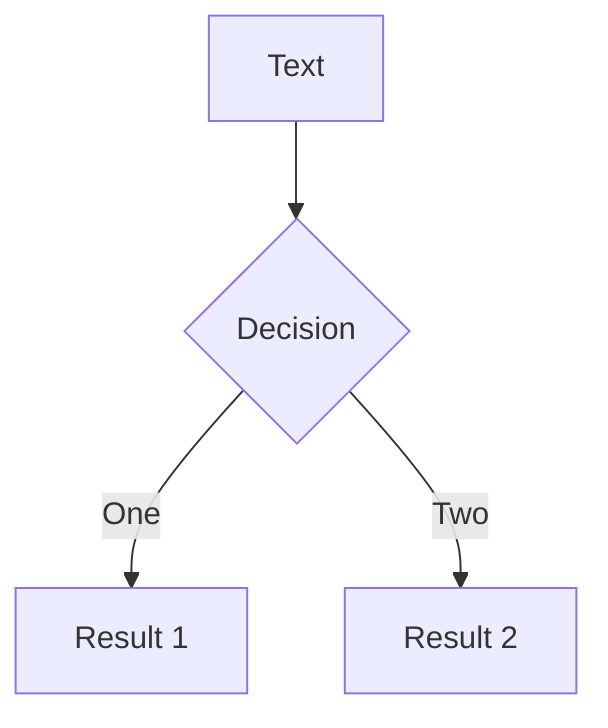
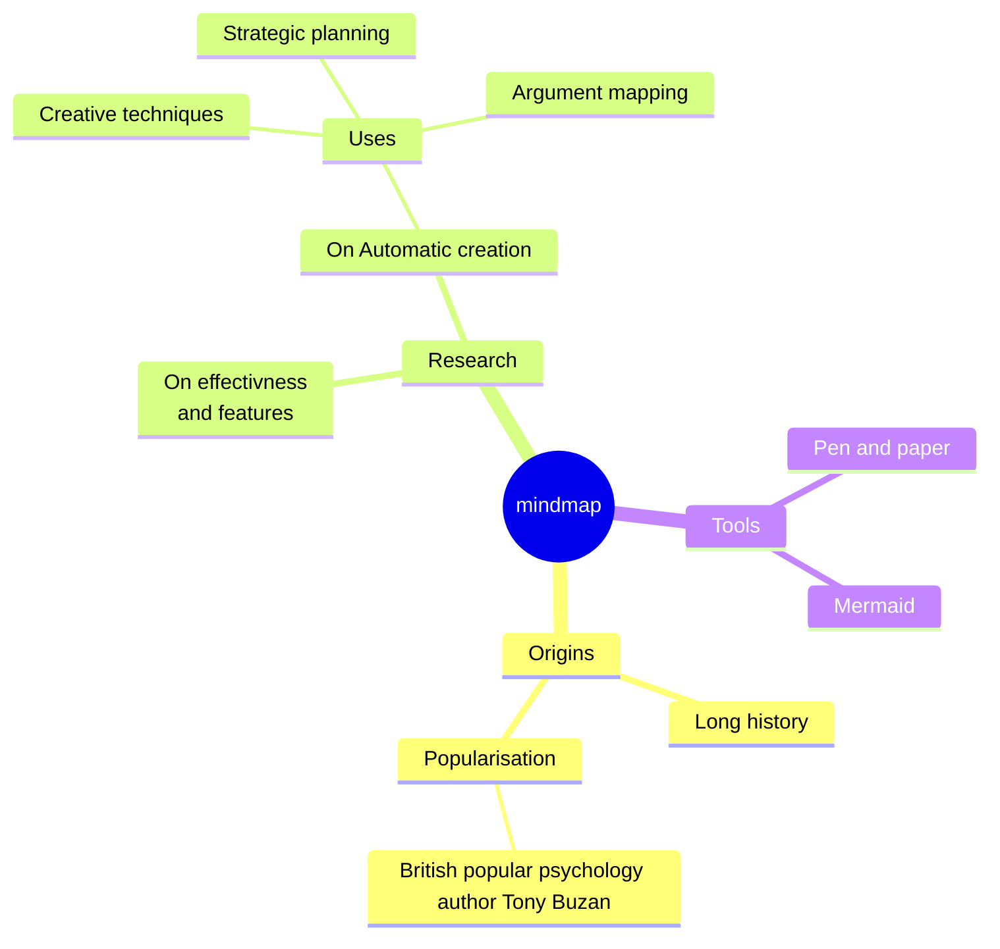
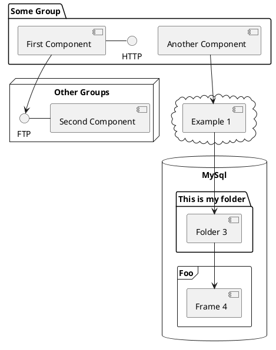

---
# try also 'default' to start simple
theme: dracula

# apply any windi css classes to the current slide
class: "text-center"
# https://sli.dev/custom/highlighters.html
highlighter: shiki
# show line numbers in code blocks
lineNumbers: false
# some information about the slides, markdown enabled
info: |
  ## Slidev Starter Template
  Presentation slides for developers.

  Learn more at [Sli.dev](https://sli.dev)
# persist drawings in exports and build
drawings:
  persist: false
# page transition
transition: slide-left
# use UnoCSS
css: unocss
---

# Railway Oriented Programming

(in Typescript)

<!--
The last comment block of each slide will be treated as slide notes. It will be visible and editable in Presenter Mode along with the slide. [Read more in the docs](https://sli.dev/guide/syntax.html#notes)
-->

---

<div class="px-24">

## Intro

<br/>

# About me

<div grid="~ cols-2 gap-4">
<div>

<div class="rounded-full mt-12 overflow-hidden h-40 w-40">

</div>

</div>

<div class="flex flex-col items-center justify-center">

### Laurenz Honauer

<br/>

- Freelance Dev/Consulting
- Co-Founder of <b>Superlight</b>

</div>
</div>

<div class="abs-br m-6 flex gap-2">
<a href="https://github.com/lauhon" target="_blank" alt="GitHub"
    class="text-xl slidev-icon-btn opacity-50 !border-none !hover:text-white">
<carbon-logo-github />
</a>

</div>

</div>

<style>
  b {
  background-color: #2b90b6;
  background-image: linear-gradient(45deg, #4ec5d4 10%, #241bc5 80%);
  background-size: 100%;
  -webkit-background-clip: text;
  -moz-background-clip: text;
  -webkit-text-fill-color: transparent;
  -moz-text-fill-color: transparent;
}
</style>

---

## Railway Oriented Programming

# What is this?

<br/>

- 🙆‍♂️ **Scott Wlaschin** - introduced the term in [this talk](https://vimeo.com/113707214)
  - A Functional Approach to Error Handling
- 📝 **Functional Programming** - Everything is a "pipe"


<br>
<br>

<!--
You can have `style` tag in markdown to override the style for the current page.
Learn more: https://sli.dev/guide/syntax#embedded-styles
-->

<!--
Here is another comment.
-->

---

## Example

# Optimistic User Update

<div class="flex items-center justify-center h-[80%]">

</div>

---

## Example

# Optimistic User Update - Imperative

```ts {all|1-5|8-9|11-12|13-16|17-18}
type UpdateRequest = {
  userId: string;
  email: string;
  newName: string;
};

const updateUser = (requestBody: unknown, res: SomeResponse) => {
  // Validate Request
  const validatedRequest: UpdateRequest = validateRequest(request);

  // Get User by ID
  const user = dbClient.getUser(validatedRequest);

  // Update User in DB
  user.update({ name: newName });

  // Send Success Response
  res.send({ success: true });
};
```

---

## Example

# Optimistic User Update - Functional

```ts {all|8|9|10|11}
type UpdateRequest = {
  userId: string;
  email: string;
  newName: string;
};

const updateUser = (requestBody: unknown, res: SomeResponse) => {
  validateRequest(request)
    .andThen(getUserPure)
    .andThen(updateUserPure)
    .andThen(sendResponsePure);
};
```

---

## Example

# Realistic User Update

<div class="flex items-center justify-center h-[80%]">


</div>

---

## Example

# Realistic User Update - Imperative

```ts
const updateUser = (requestBody: unknown, res: SomeResponse) => {
  // Validate Request
  const validatedRequest: UpdateRequest = validateRequest(request);

  // Get User by ID
  const user = dbClient.getUser(validatedRequest);

  // Update User in DB
  user.update({ name: newName });

  // Send Success Response
  res.send({ success: true });
};
```

---

## Example

# Realistic User Update - Imperative

```ts {2-7}
const updateUser = (requestBody: unknown, res: SomeResponse) => {
  // Validate Request
  try {
    const validatedRequest: UpdateRequest = validateRequest(request);
  } catch (err) {
    res.send({ success: false, error: err });
  }

  // Get User by ID
  const user = dbClient.getUser(validatedRequest);

  // Update User in DB
  user.update({ name: newName });

  // Send Success Response
  res.send({ success: true });
};
```

---

## Example

# Realistic User Update - Imperative

```ts {8-15}
const updateUser = (requestBody: unknown, res: SomeResponse) => {
  // Validate Request
  try {
    const validatedRequest: UpdateRequest = validateRequest(request);
  } catch (err) {
    res.send({ success: false, error: err });
  }

  // Get User by ID
  try {
    const user = dbClient.getUser(validatedRequest);
  } catch (err) {
    res.send({ success: false, error: err });
  }

  // Update User in DB
  user.update({ name: newName });

  // Send Success Response
  res.send({ success: true });
};
```

---

## Example

# Realistic User Update - Imperative

```ts {16-22}
const updateUser = (requestBody: unknown, res: SomeResponse) => {
  // Validate Request
  try {
    const validatedRequest: UpdateRequest = validateRequest(request);
  } catch (err) {
    res.send({ success: false, error: err });
  }

  // Get User by ID
  try {
    const user = dbClient.getUser(validatedRequest);
  } catch (err) {
    res.send({ success: false, error: err });
  }

  // Update User in DB
  try {
    user.update({ name: newName });
  } catch (err) {
    res.send({ success: false, error: err });
  }
  ...

};
```

---

## Example

# Realistic User Update - Functional

```ts
const updateUser = (requestBody: unknown, res: SomeResponse) => {
  validateRequest(request)
    .andThen(getUserPure)
    .andThen(updateUserPure)
    .andThen(sendResponsePure);
};
```

<p v-click class="text-5xl pt-12 text-center" style-0>❤️</p>

---

## How can this work?

# Railway Oriented Programming


---

## How can this work?

# Neverthrow

<div class="lex gap-2 mb-12">
<a href="https://github.com/supermacro/neverthrow" target="_blank" alt="GitHub"
    class="text-xl slidev-icon-btn opacity-50 !border-none !hover:text-white">
<carbon-logo-github />
https://github.com/supermacro/neverthrow
</a>

</div>

```ts
import { Result, ok, err } from "neverthrow";

const divideRoundNumber = (input: number): Result<number, Error> => {
  if (input % 2 !== 0) {
    return err(new Error("Input is not an even number"));
  }

  return ok(input / 2);
};
```

---

## layout: default

# Table of contents

```
<Toc minDepth="1" maxDepth="5"></Toc>
```

<Toc></Toc>

---

transition: slide-up

## level: 2

# Navigation

Hover on the bottom-left corner to see the navigation's controls panel, [learn more](https://sli.dev/guide/navigation.html)

### Keyboard Shortcuts

|                                                    |                             |
| -------------------------------------------------- | --------------------------- |
| <kbd>right</kbd> / <kbd>space</kbd>                | next animation or slide     |
| <kbd>left</kbd> / <kbd>shift</kbd><kbd>space</kbd> | previous animation or slide |
| <kbd>up</kbd>                                      | previous slide              |
| <kbd>down</kbd>                                    | next slide                  |

<!-- https://sli.dev/guide/animations.html#click-animations -->


<p v-after class="absolute bottom-23 left-45 opacity-30 transform -rotate-10">Here!</p>

---

layout: image-right
image: https://source.unsplash.com/collection/94734566/1920x1080

---

# Code

Use code snippets and get the highlighting directly![^1]

```ts {all|2|1-6|9|all}
interface User {
  id: number;
  firstName: string;
  lastName: string;
  role: string;
}

function updateUser(id: number, update: User) {
  const user = getUser(id);
  const newUser = { ...user, ...update };
  saveUser(id, newUser);
}
```

<arrow v-click="3" x1="400" y1="420" x2="230" y2="330" color="#564" width="3" arrowSize="1" />

[^1]: [Learn More](https://sli.dev/guide/syntax.html#line-highlighting)

<style>
.footnotes-sep {
  @apply mt-20 opacity-10;
}
.footnotes {
  @apply text-sm opacity-75;
}
.footnote-backref {
  display: none;
}
</style>

---

# Components

## CONS

oyu have to write wrappers
hard to understand for juniors - maybe only makes sense, when you expect a complex application

You can use Vue components directly inside your slides.

We have provided a few built-in components like `<Tweet/>` and `<Youtube/>` that you can use directly. And adding your custom components is also super easy.

```html
<Counter :count="10" />
```

<!-- ./components/Counter.vue -->
<Counter :count="10" m="t-4" />

Check out [the guides](https://sli.dev/builtin/components.html) for more.

</div>
<div>

```html
<Tweet id="1390115482657726468" />
```

<Tweet id="1390115482657726468" scale="0.65" />

</div>
</div>

<!--
Presenter note with **bold**, *italic*, and ~~striked~~ text.

Also, HTML elements are valid:
<div class="flex w-full">
  <span style="flex-grow: 1;">Left content</span>
  <span>Right content</span>
</div>
-->

---

## class: px-20

# Themes

Slidev comes with powerful theming support. Themes can provide styles, layouts, components, or even configurations for tools. Switching between themes by just **one edit** in your frontmatter:

<div grid="~ cols-2 gap-2" m="-t-2">

```yaml
---
theme: default
---
```

```yaml
---
theme: seriph
---
```


</div>

Read more about [How to use a theme](https://sli.dev/themes/use.html) and
check out the [Awesome Themes Gallery](https://sli.dev/themes/gallery.html).

---

## preload: false

# Animations

Animations are powered by [@vueuse/motion](https://motion.vueuse.org/).

```html
<div v-motion :initial="{ x: -80 }" :enter="{ x: 0 }">Slidev</div>
```

<div class="w-60 relative mt-6">
  <div class="relative w-40 h-40">
    
    
    
  </div>

  <div
    class="text-5xl absolute top-14 left-40 text-[#2B90B6] -z-1"
    v-motion
    :initial="{ x: -80, opacity: 0}"
    :enter="{ x: 0, opacity: 1, transition: { delay: 2000, duration: 1000 } }">
    Slidev
  </div>
</div>

<!-- vue script setup scripts can be directly used in markdown, and will only affects current page -->
<script setup lang="ts">
const final = {
  x: 0,
  y: 0,
  rotate: 0,
  scale: 1,
  transition: {
    type: 'spring',
    damping: 10,
    stiffness: 20,
    mass: 2
  }
}
</script>

<div
  v-motion
  :initial="{ x:35, y: 40, opacity: 0}"
  :enter="{ y: 0, opacity: 1, transition: { delay: 3500 } }">

[Learn More](https://sli.dev/guide/animations.html#motion)

</div>

---

# LaTeX

LaTeX is supported out-of-box powered by [KaTeX](https://katex.org/).

<br>

Inline $\sqrt{3x-1}+(1+x)^2$

Block

$$
\begin{array}{c}

\nabla \times \vec{\mathbf{B}} -\, \frac1c\, \frac{\partial\vec{\mathbf{E}}}{\partial t} &
= \frac{4\pi}{c}\vec{\mathbf{j}}    \nabla \cdot \vec{\mathbf{E}} & = 4 \pi \rho \\

\nabla \times \vec{\mathbf{E}}\, +\, \frac1c\, \frac{\partial\vec{\mathbf{B}}}{\partial t} & = \vec{\mathbf{0}} \\

\nabla \cdot \vec{\mathbf{B}} & = 0

\end{array}
$$

<br>

[Learn more](https://sli.dev/guide/syntax#latex)

---

# Diagrams

You can create diagrams / graphs from textual descriptions, directly in your Markdown.

<div class="grid grid-cols-3 gap-10 pt-4 -mb-6">









</div>

[Learn More](https://sli.dev/guide/syntax.html#diagrams)

---

src: ./pages/multiple-entries.md
hide: false

---

---

layout: center
class: text-center

---

# Learn More

[Documentations](https://sli.dev) · [GitHub](https://github.com/slidevjs/slidev) · [Showcases](https://sli.dev/showcases.html)

---

## layout: end
